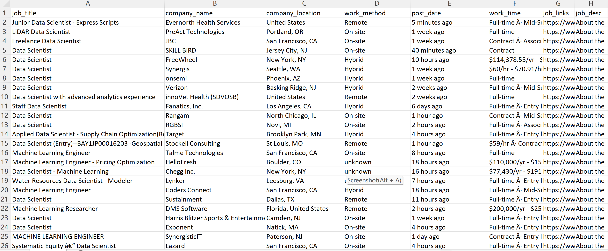

# LinkedIn Job Crawler

LinkedIn Job Crawler is a tool that allows you to easily scrape job postings from LinkedIn.com. With this tool, you can save time and effort by automatically gathering job information directly from the site, rather than manually searching for job postings.

## Features

- Automatically crawl job postings from LinkedIn.com
- Download job information as a CSV file for easy analysis and storage

## Requirements

- Python 3.10
- A LinkedIn account

## Usage

1. Clone the repository
   `git clone https://github.com/sixian-C/linkedin_job_crawler.git`
2. Install the required libraries
3. Set your LinkedIn account credentials in `config.yaml`
4. Run the script

## Showcase

## Contributing

We welcome contributions from the community. If you find a bug or have an idea for a new feature, feel free to open an issue or create a pull request.
